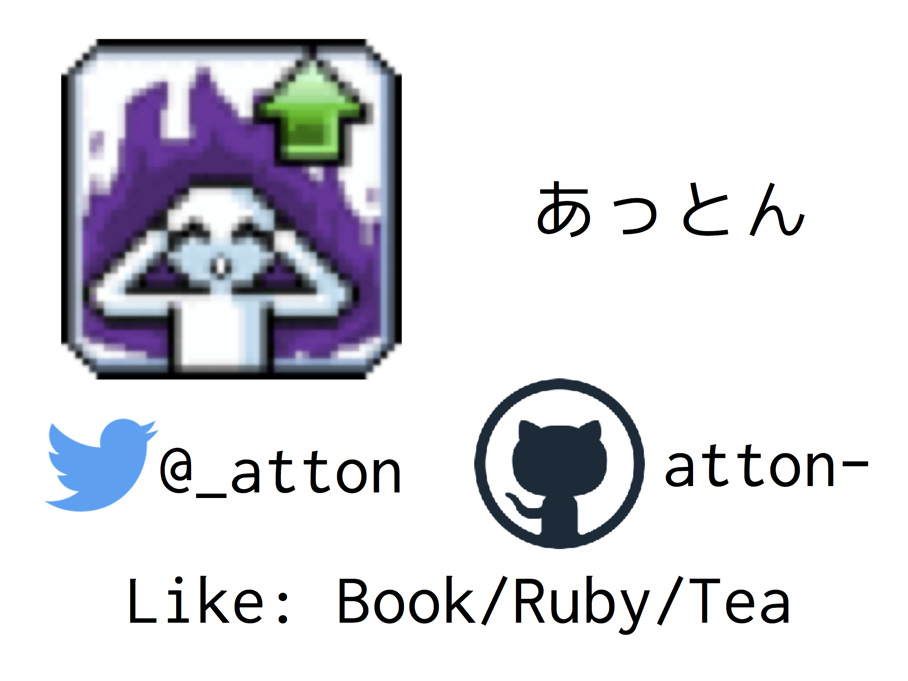

<head>
    <!-- Global site tag (gtag.js) - Google Analytics -->
    
    
</head>

<title>atton.github.com</title>

# Accounts
* Blog: [atton.blog](https://attonblog.blogspot.jp/)
* GitHub:  [atton](https://github.com/atton)
* Twitter: [@_atton](https://twitter.com/_atton), tweet archive: [20171031](twitter-archive/index.html)
* Amazon: [wish list](https://www.amazon.co.jp/registry/wishlist/273DXGJEJLEVN/)
* Book meter: [atton](https://bookmeter.com/users/764422)
* Discord: atton#6894
* FGO: もみじ(565,422,721)
* PSN: atton_34
* Animetick: [_atton](http://animetick.net/users/_atton)
* pawoo: [_atton](https://pawoo.net/@_atton)
* mstdn.jp: [atton](https://mstdn.jp/@atton)
* Aizu Online Judge: [atton](http://judge.u-aizu.ac.jp/onlinejudge/user.jsp?id=atton) [repository](https://github.com/atton/aoj)
* AtCoder: [atton](http://atcoder.jp/user/atton) [repository](https://github.com/atton/AtCoder)
* bit coin address: 4K61u2B3k5bGmwCyDSMKyL8uF5xi7z863D

# Self Introduction

## Job
* Freelance Engineer
    * Main: Web backend
    * Sub: Infrastructure, Web frontend

## 料金
* Web Application(フルスクラッチ) 1,500,000円~
* Web Application(機能追加, 保守) 750,000円~
* サーバ環境構築, メンテナンス, 保守など 1,000,000円~

* オフラインミーティング(会議室など): 75,000円~
* オンラインミーティング(Discord など): 0円~
* 新サービス立ち上げ、新規事業立ち上げ、技術顧問: 応相談

* お仕事に関しては
    * 時給換算でなく、実装や環境構築など(仕様ベース, Issueベース, 機能要件ベース, 数値ベース, ...)
    * 準委任契約
    * 基本的にリモートワーク(毎日出社必須だと要相談)
    * ベンチャー企業なら報酬を一部株で代替可能
* でお願いします。
* また、フリーランスは各種の手当・賞与・退職金が無いことや、健康保険料と年金が自己負担であることを考慮した上で値段交渉して頂けると幸いです。
* 初月はお試しとして契約し、初月の活動を評価した上で、契約継続/報酬交渉なども可能です。
* ただ、初月の報酬は前払い(数割前払いでも可能)でお願いします。

## Job History
* Part-time jobs
  * Project using Rails 4
  * 2014/07-2015/03, 2016/03-2016/06
  * time of part-time job over 370 hours
* Master's graduation(2017/03)
* [DWANGO](http://dwango.co.jp) (2017/04~2017/07)
* Freelance Engineer (2017/08~)
    * Project using Rails 5.1
        * Main Development Period: 2017/08~2017/09
        * About 3k lines(maximum performance: 3k lines/2weeks) with rspec
        * I implemented all features(Our team has only one engineer(me)).
        * Maintain Period: 2017/10~11
        * Full remote work
    * Project(2018/02~2018/06)
        * Details are protected by NDA.
    * work with [Carat Inc.](https://www.caratinc.jp) 2019/08~
        * Full remote work
        * Rails + AWS

## Programming Experiences and Skills
* Ruby(2012~)
    * A most writable language.
    * Develop web application using Rails 4 as part time job(2 year).
    * Maintain private cloud system for department of university of ryukyus(ie-ryukyu).
        * Named ["Akatsuki"](https://github.com/atton/akatsuki)
        * Details: bottom of this page
    * Original gem ["noir"](https://github.com/atton/noir)
        * Utilitiy commands for myself.
* Haskell, Agda(2013~)
    * uses for my research in a university.
    * I wrote a thesis using Haskell and Agda.
* Java, C, C++, Perl, Python, Shell Script, JavaScript, Scala, VHDL, scheme, golang, PHP, Elm, Promela ...
    * Tutorial level or tutorial + alpha level.

## Infrastructure Experiences
* Manage On-premises servers in University(2012~2016)
    * CentOS7, VMWare, LDAP, BIND9, RADIUS, DHCP, libvirt
* Replace On-premises servers in University(2016)
    * using our system [Akatsuki](https://github.com/atton/akatsuki)
    * CentOS7, HA Cluster, GFS2, LDAP, BIND9, RADIUS, DHCP, libvirt, Docker
* Maintain On-premises servers in University(2016~2017)

## Infrastructure Skills
* L1,L2,L3,knowledge: cisco(CCENT Level) 2008~
* Cloud services: sakura cloud, heroku, AWS(EC2, S3), GCP(Compute Engine)
* Services: LDAP, BIND9, RADIUS, DHCP, libvirt, Docker
    * tutorial level + alpha

## Tools which I usually use
* macOS
* Linux
    * usually RHEL(CentOS, Fedora)
* NeoVim
* Git
    * can (rebase -i, reflog, reset --hard, bisect, cherry-pick, blame, ...)
* tmux
    * use for multiple windows/panels in terminal.
    * using [half-width patched version](https://attonblog.blogspot.jp/2017/04/full-width-tmux.html).
* Docker
    * My local sandbox or local development environment with Dockerfile.
* my [dot files](https://github.com/atton/dot_files)

## LICENSES
* 普通自動車免許(2012)
* Cisco CCENT(2009)
* IPA 応用情報技術者(2009)
* IPA 基本情報技術者(2009)
* IPA 初級システムアドミニストレータ(2008)

# Slides
* 2017/07/24 : Laravel 紹介 [スライド](slides/laravel51/slide.html)
* 2016/05/16 : akatsuki読み [スライド](slides/akatsuki-reading/slide.html)
* 2016/09/30 : 新学科システム説明会(ユーザコンソール部分) [スライド](slides/syskan-new-system-presentation/slide.html)
* 2015/04/25 : [新入生歓迎LT大会 2015](https://a2abe3fb399b60bc8c18fbfcd3.doorkeeper.jp/events/23373) [スライド(pdf)](slides/ie-lt-2015/ie-lt-2015.pdf)
* 2015/02/22 : [ギークハウス沖縄解散パーティLT](https://atnd.org/events/61450) [スライド](slides/geeoki_last/geeoki.html)
* 2014/08/23 : [Vim勉強会2014](https://atnd.org/events/55445) [スライド](slides/ie-vim-2014/slide.html)
* 2014/05/24 : [オープンソースカンファレンス 2014 Okinawa](http://www.ospn.jp/osc2014-okinawa/) [スライド](slides/osc2014/slide.html)
* 2014/04/26 : [新入生歓迎LT祭り 2014](https://atnd.org/events/49555) [スライド(pdf)](slides/ie-lt-2014/ie-lt-2014.pdf)
* 2014/03/26 : [Haskell 勉強会](https://atnd.org/events/48884)_[資料](https://github.com/ie-developers/ie-haskell)
* 2013/08/10 : [xhago4](http://hago.doorkeeper.jp/events/4396) [スライド](slides/xhago4/xhago4.html)
* 2012/08/13 : [Vim勉強会](http://atnd.org/events/30822) [スライド](slides/iedev_vim/iedev_vim.html)

# OSS Contributions

## Pull Requests

* [caskroom/homebrew-cask](https://github.com/caskroom/homebrew-cask)
    * Add Karbowanec.app 1.1.9 [#41463](https://github.com/caskroom/homebrew-cask/pull/41463) (not merged)
* [tmux/tmux](https://github.com/tmux/tmux)
    * Fix East Asian Ambiguous (Unity half-width) [#1140](https://github.com/tmux/tmux/pull/1140) (not merged)
* [fog/fog-libvirt](https://github.com/fog/fog-libvirt)
    * Volume#clone_volume supports different pools [#46](https://github.com/fog/fog-libvirt/pull/46)
* [shairontoledo/rghost](https://github.com/shairontoledo/rghost)
    * Raise RuntimeException when try convert from unspported class [#67](https://github.com/shairontoledo/rghost/pull/67) (merged)
* [dwango/scala_text](https://github.com/dwango/scala_text)
    * 型パラメタの例の修正 [#275](https://github.com/dwango/scala_text/pull/275) (merged)
* [vimperator/vimperator-labs](https://github.com/vimperator/vimperator-labs)
    * Support `<C-[>, <C-]>, <C-^>, <C-\\>, <C-_>, <C-->` in Mac [#53](https://github.com/vimperator/vimperator-labs/pull/53) (merged)
* [marzocchi/zsh-notify](https://github.com/marzocchi/zsh-notify)
    * Support background notify in tmux [#5](https://github.com/marzocchi/zsh-notify/pull/5) (self close)
* [thinca/vim-ref](https://github.com/thinca/vim-ref)
    * webdict ソースに start_linenumber オプションを追加してみました。 [#15](https://github.com/thinca/vim-ref/pull/15) (not merged but author adds features)

## Customized sources for me
* [a.vim](https://github.com/atton/a.vim)
* [utf8proc](https://github.com/atton/utf8proc)
* [xv6](https://github.com/atton/xv6)
* [zsh-notify](https://github.com/atton/zsh-notify)
* [fog-libvirt](https://github.com/atton/fog-libvirt)
* [tmux](https://github.com/atton/tmux)

## Original Project or Contributions
* [agda-proofs](https://github.com/atton/agda-proofs)
    * my agda sandbox
* [Akatsuki](https://github.com/atton/akatsuki)
    * Open-Sourced version.
    * private cloud system of department of university of ryukyus.
    * Rails 4, about 3k lines with rspec.
    * Main development period: 3 month.
    * Maintain period: 18 month.
    * Has several component([KVM](https://attonblog.blogspot.jp/2015/10/control-kvm-using-fog-libvirt.html), LDAP, [BIND9](https://attonblog.blogspot.jp/2015/10/bind-sdb-with-rails.html), [DHCP](https://attonblog.blogspot.jp/2015/12/freeradius-multiple-dhcp.html), [FreeRADIUS](https://attonblog.blogspot.jp/2015/10/freeradius-dhcp-with-rails.html))
    * Akatsuki works 4 on-premise servers constructed by [GFS2](https://attonblog.blogspot.jp/2015/11/centos7-hacluster-gfs2.html) on university.
    * Akatsuki controls 1000+IP, 400+VM for 500+ users.
    * Related blog posts [here](https://attonblog.blogspot.jp/2016/05/akatsuki-reading.html) and [here](https://attonblog.blogspot.jp/2017/10/akatsuki-oss.html).
* [OfflineSuite](https://itunes.apple.com/jp/app/offlinesuite/id626097819)
    * iOS Project in University
* [delta_monad](https://github.com/atton/delta_monad)
    * my thesis
* [hdd-keeper](https://github.com/atton/hdd-keeper)
    * hdd keeper using 3D Printer
* [heroes_and_daemons](https://github.com/atton/heroes_and_daemons)
    * Battle Game for exercise in University
    * using Unity 4
* [homebrew-customs](https://github.com/atton/homebrew-customs)
    * collections of formulae for me
* [krb-script](https://github.com/atton/krb-script)
    * Karbowanec Provisioning scripts.
* [noir](https://github.com/atton/noir)
    * collections of utils for me(ruby gem)
* [similar_monad](https://github.com/atton/similar_monad)
    * base of my thesis(sandbox)
* [slideshow-cr](https://github.com/atton/slideshow-cr)
    * slideshow theme
* [slideshow-s6cr](https://github.com/atton/slideshow-s6cr)
    * slideshow theme(S6 version)

# Hobby
* Reading books
    * favorite authors: 伊藤計劃, 西尾維新, 入間人間, 野崎まど, 三秋 縋 ...
* Programming
* Play game
    * Play Station 4, Vita
* Tea
